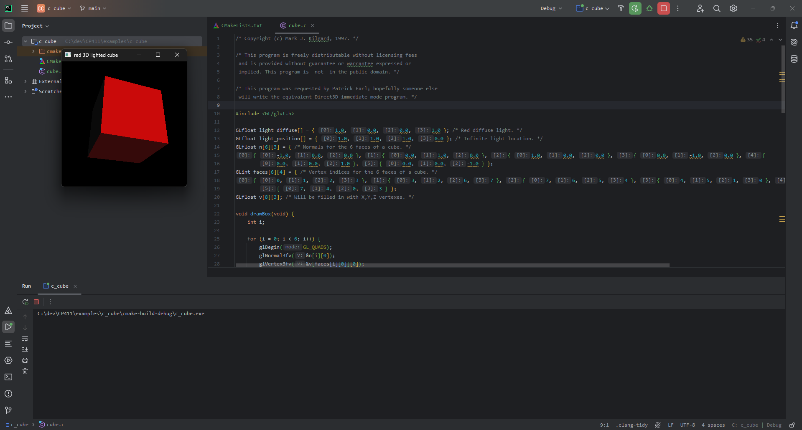
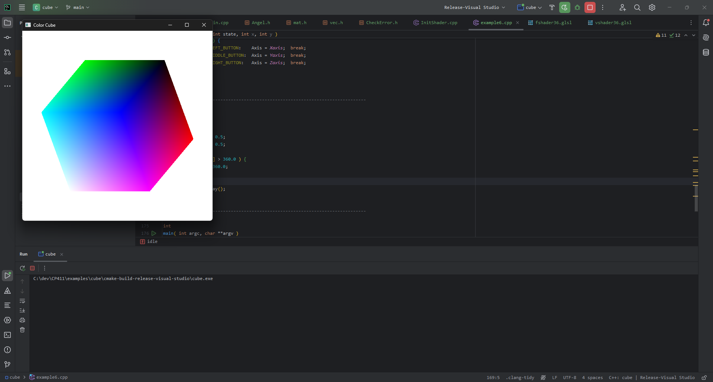
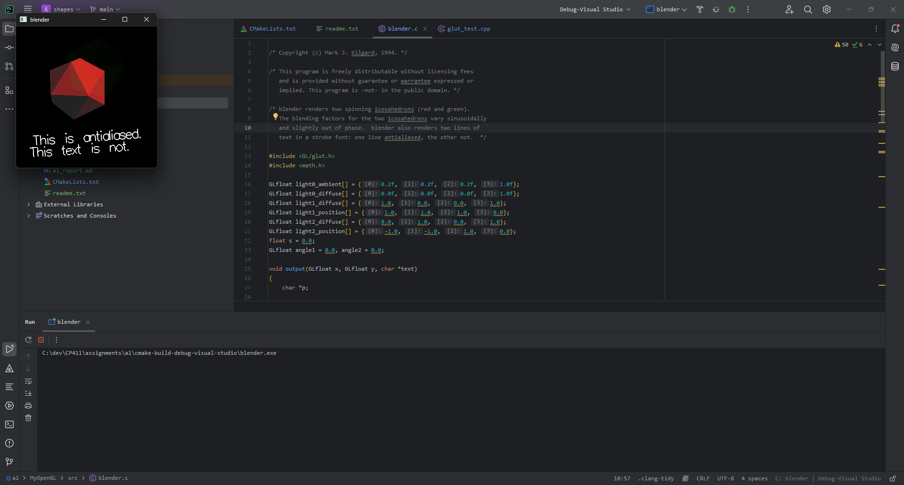
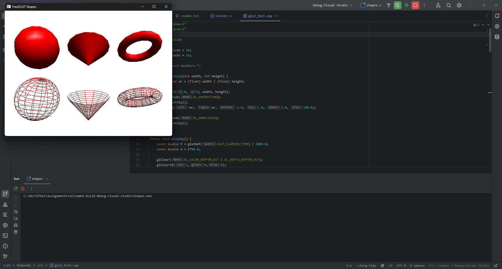

## 1.1 Framebuffers

**Framebuffer:** A memory block that stores data of all pixels of raster pattern line by line. Each dot of an image has a  corresponding position in the memory, the value stored in the memory position represents the data, e.g. color, of the dot.

## 1.2 Pixels, Color Depth, & Resolution

**Pixel:** A 'dot' in a raster pattern, or a pixel on a screen.
: Any of the small discrete elements that together constitute an image (as on a television or digital screen) ([source](https://www.merriam-webster.com/dictionary/pixel))

**Color Depth:** The number of bits taken by a pixel, typically 1, 8, 16, 24, 32, or 64 bits. Includes RGB, BGR, RGBA, ARGB, etc. color formats.

**Resolution:** The `X` by `Y` dimensions of the output, typically the [framebuffer](#11-framebuffers) or an output device such as an LED display. The first number is the size of a row in pixels, and the second number is the number of rows.

## 1.3 Frame, Refreshment, & Refresh Rate

A frame refers to a full scan and display of image on screen.

- A frame must be “refreshed” to draw new images
- On a CRT display:
  - As new pixels are struck by electron beam, others are decaying - Electron beam must hit all pixels frequently to eliminate flicker.

## 2.1 The Two Basic Image Rendering Approaches

- Rasterization: for each object, compute and set the pixels of the object to framebuffer.
- Ray tracing: for each pixel, create a ray from eye to the pixel, compute the color of an object that the ray hits, the set the color to the pixel.

## 2.2 Why Rasterization Is The Most Commonly Used Graphics Approach

Rasterization is the most commonly used graphics approach due to requiring orders of magnitude less processing power, which makes it preferable for the majority of graphics processing tasks.

## 3.1 The CPU's Role

The CPU does model computing. It sends graphic object model data (e.g., vertices of a triangle, textures, lights) to video memory and instructions to GPU.

## 3.2 The GPU's Role

The GPU processes object data, rasterizes (generates pixel data) and writes the pixel data to the framebuffer.

## 4.1 C/C++ & OpenGL Installation

C/C++ are already installed, and eclipse is not being used. Instead I am using CLion and CMake.

CMake code for the basic cube example:

```cmake
cmake_minimum_required(VERSION 3.29)
project(c_cube C)

set(CMAKE_C_STANDARD 11)

include_directories(C:/dev/CP411/include/)
link_directories(C:/dev/CP411/lib/Release/x64)

add_compile_definitions(NDEBUG)
add_compile_options(-DGLEW_STATIC)

add_executable(c_cube cube.c)
target_link_libraries(c_cube glew32s)
target_link_libraries(c_cube freeglut)


add_custom_command(TARGET c_cube POST_BUILD            # Adds a post-build event
        COMMAND ${CMAKE_COMMAND} -E copy_if_different  # which executes "cmake - E copy_if_different..."
        "C:/dev/CP411/bin/Release/x64/freeglut.dll"    # <-- target to copy
        $<TARGET_FILE_DIR:c_cube>                      # <-- this is the output path
)
```

Output:

{ width=50%, height=50% }

CMake code for the GLSL cube example:

```cmake
cmake_minimum_required(VERSION 3.29)
project(cube)

set(CMAKE_CXX_STANDARD 20)

include_directories("C:/dev/CP411/include/")
link_directories("C:/dev/CP411/lib/Release/x64")

add_compile_definitions(NDEBUG)
add_compile_options(-DGLEW_STATIC)

add_executable(cube
        example6.cpp
        InitShader.cpp
)

target_link_libraries(cube glew32s)
target_link_libraries(cube freeglut)

add_custom_command(TARGET cube POST_BUILD              # Adds a post-build event
        COMMAND ${CMAKE_COMMAND} -E copy_if_different  # which executes "cmake - E copy_if_different..."
        "C:/dev/CP411/bin/Release/x64/freeglut.dll"    # <-- target to copy
        $<TARGET_FILE_DIR:cube>                        # <-- this is the output path
)

add_custom_command(TARGET cube POST_BUILD              # Adds a post-build event
        COMMAND ${CMAKE_COMMAND} -E copy_if_different  # which executes "cmake - E copy_if_different..."
        "C:/dev/CP411/examples/cube/vshader36.glsl"    # <-- target to copy
        $<TARGET_FILE_DIR:cube>                        # <-- this is the output path
)

add_custom_command(TARGET cube POST_BUILD              # Adds a post-build event
        COMMAND ${CMAKE_COMMAND} -E copy_if_different  # which executes "cmake - E copy_if_different..."
        "C:/dev/CP411/examples/cube/fshader36.glsl"    # <-- target to copy
        $<TARGET_FILE_DIR:cube>                        # <-- this is the output path
)
```

Output:



## 4.2 OpenGL C

For this, again CMake was used.


<!---->

## 4.3 OpenGL C++


<!---->
