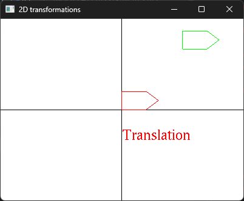
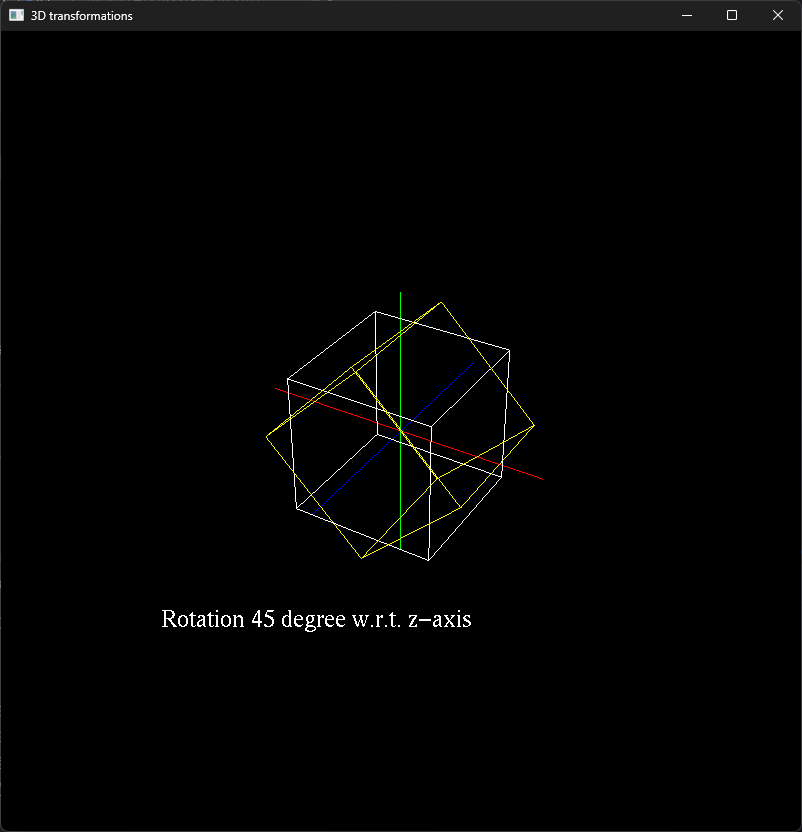

---
# pandoc metadata
title: "Assignment A3 Report"
author: "Shurjo Majumder, ID: 169035249"
date: "Fall 2024"
output:
  pdf_document: default
  html_document: default
  bookdown::pdf_document2: default
---

Check [readme.txt](readme.txt) for course work statement and self-evaluation. 
  
## Q1 Transformations in CG (description)

### Q1.1 Principle of CG transformations

1. What are the three basic transformations?
   1. Rotation
   2. Translation
   3. Scaling
2. What is a composite transformation?
   1. One or more transformations combined together.
3. Why Homogeneous coordinate system is used in transformation representation and computing?
   1. Because they're easier to work with, and are less error prone.

### Q1.2 Hand on 2D transformations

1. Describe the sequence of basic 2D transformations to transform triangle ABC to triangle A’B’C’, namely, A to A’, B to B’, and C to C’, by writing the transformation notations and matrices in Homogeneous of the above basic transformations. Hint: it needs 3 basic transformations.

```
Translate(X=1, Y=-3)
Rotate(180 degrees)
Scale(X=4/3, Y=1/2)
```

2. Compute the transformation matrix of the composite transformation.

Column major (imagine the Latex rendered):

$$
\begin{matrix}
-\frac{4}{3} & 0 & 1 \\\\  
0 & -\frac{1}{2} & -3 \\\\  
0 & 0 & 1
\end{matrix}
$$

3. Apply the composite transformation matrix to A, B, C to verify that A, B, C are transformed to A’, B’, C’, respectively.

A -> (0, 0)  
B -> (4, 0)  
C -> (0, 1)  

## Q2 CG transformation programming (lab practice)

### Q2.1 Warm up with C++ 

Yes.


### Q2.2 2D transformations 



### Q2.3 3D objects and transformations



### Q2.4 Mesh object model 


## Q3 SimpleView1 - transformations (programming)

I have completed this section, however, despite my best efforts, my anti-virus keeps shooting the program down. I am not able to run this program on my machine. Perhaps it can run on another? I don't know.

The program does work when using GLFW as the windowing system, but fails when using FreeGLUT.

### References

1. CP411 a3
